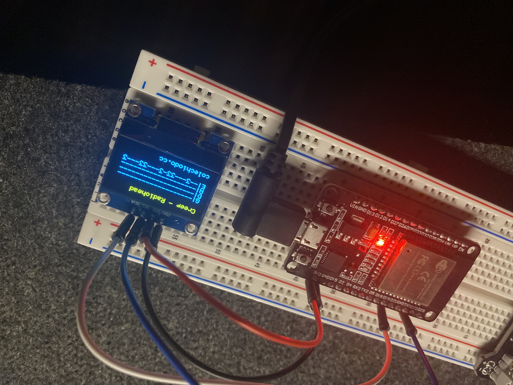
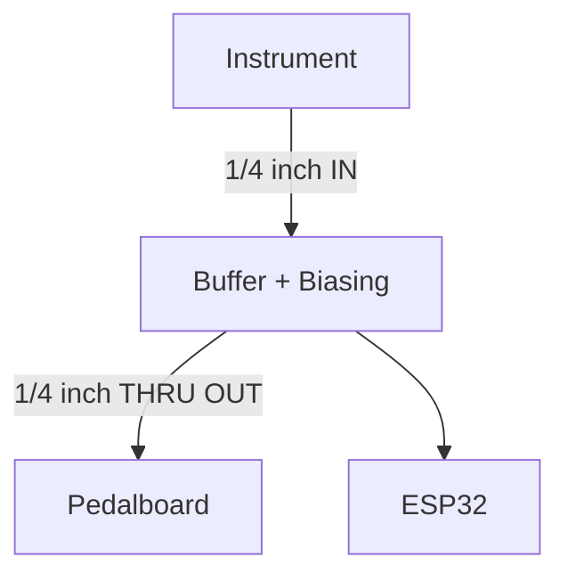

# Bass Hero - Guitar Pedal (WIP)



This project is an open-source **guitar pedal** built around an **ESP32**. It's a game that you can play with your guitar/bass, reading tablature and providing real-time feedback on the player's pitch and timing accuracy (similar to [Rocksmith](https://store.steampowered.com/app/221680/Rocksmith_2014_Edition_REMASTERED_LEARN__PLAY/)).

The pedal sits in the signal chain, passing the signal through *uncolored* to your amp while analyzing your playing for a fun practice experience at the same time. 

## Overview

### What it does:
- Loads bass tabs from an **SD card**. It then displays the music, scrolling it across an **OLED screen** as you play.

### How it teaches:
- It provides instant feedback by **detecting the note you are playing** and compares it against the tab. It provides a **score** for accuracy in both pitch and timing.

### Zero Interference:
- The pedal is designed so your tone goes directly to your amplifier without any extra digital noise or coloration.

This device is designed to make practice more fun and engaging.

## System Architecture

The core of the project is the **ESP32**.
For file storage, we use a microSD card. This card ***MUST*** be formatted as FAT32.

## Build Your Own

Follow along below if you would like to build this project yourself.

### Electronics Partlist:
The electronics I used to build the project:

| **Cartegory** | **Item** | **#** | **Notes** |
| :--- | :--- | :--- | :--- |
| **Core** | [ESP32](https://www.amazon.com/ESP-WROOM-32-Development-Microcontroller-Integrated-Compatible/dp/B08D5ZD528) | 1 | Core microcontroller. |
| **Display** | [OLED](https://www.amazon.com/Hosyond-Display-Self-Luminous-Compatible-Raspberry/dp/B0BFD4X6YV) | 1 | Visual output. |
| **Storage** | [Micro-SD breakout](https://www.amazon.com/UMLIFE-Interface-Conversion-Compatible-Raspberry/dp/B0989SM146) | 1 | Store tabs. |
| **Audio** | [¼″ mono jack](https://www.amazon.com/ZXHAO-6-35mm-Female-Socket-Headphone/dp/B07MR2TT3Q) | 2 | Audio Input and Output |
| **Resistors** | | | |
| **Capacitors** | | | |
| **Controls** | | | |
| **Power** | MicroUSB to USB-A Cable | 1 | Loading software to the esp/power |
| **Misc** | Breadboard | 1 | Prototyping |
| | Jumpers | 12 |  |


### Architecture Overview


### Wiring Guide
| **Component** | **Pin** | **ESP32** |
| :--- | :--- | :--- |
| **OLED** | **Pin** | **ESP32** |
|| Vin | 3V3 |
|| GND |	GND |
|| SCL |	GPIO 22 |
|| SDA |	GPIO 21 |
| **MicroSD card module** | **Pin** | **ESP32** |
|| 3V3 | 3.3V |
|| CS | GPIO 5 |
|| MOSI | GPIO 23 |
|| CLK | GPIO 18 |
|| MISO | GPIO 19 |
|| GND | GND |

## Software Build Process
To build this project, you must have the ESP-IDF installed on your system.

### Install ESP-IDF
For Arch Linux, use AUR
```bash
yay -S esp-idf
# run the provided commands after to finish installation
```

### Set up the ESP-IDF environment variables
```bash
# must be ran every time a new terminal is opened
source /opt/esp-idf/export.sh
# I set my own alias:
# alias espidf='source /opt/esp-idf/export.sh'
```

### Finally, build and run.
1. **Target the ESP board**
```bash
idf.py set-target esp32
```
2. **Build the project**
```bash
# idf.py fullclean
idf.py build
```
3. **Flash the ESP, monitor the serial output**
```bash
# Hold down "BOOT" button on the ESP, then run:
idf.py -p /dev/ttyUSB0 flash monitor
# `CTRL` + `]` to stop monitoring
```
optionally, erase using:
```bash
idf.py -p /dev/ttyUSB0 erase-flash
```
***
**© 2025 [colechiodo.cc](https://colechiodo.cc) | MIT License**