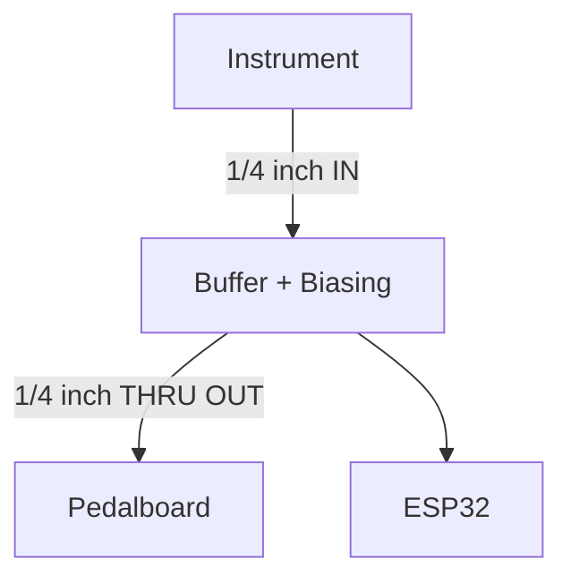

# Bass Hero - Guitar Pedal (WIP)


This project is an open-source **guitar pedal** built around an **ESP32**. It's a game that you can play with your guitar/bass, reading tablature and providing real-time feedback on the player's pitch and timing accuracy (similar to [Rocksmith](https://store.steampowered.com/app/221680/Rocksmith_2014_Edition_REMASTERED_LEARN__PLAY/)).

The pedal sits in the signal chain, passing the signal through *uncolored* to your amp while analyzing your playing for a fun practice experience at the same time. 

## Overview

### What it does:
- Loads bass tabs from an **SD card**. It then displays the music, scrolling it across a small **LCD screen** as you play.

### How it teaches:
- It provides instant feedback by **detecting the note you are playing** and compares it against the tab. It provides a **score** for accuracy in both pitch and timing.

### Zero Interference:
- The pedal is designed so your tone goes directly to your amplifier without any extra digital noise or coloration.

This device is designed to make practice more fun and engaging.

## System Architecture

The core of the project is the **ESP32**.

## Build Your Own

Follow along below if you would like to build this project yourself.

### Electronics Partlist:
The electronics I used to build the project:

| **Cartegory** | **Item** | **#** | **Notes** |
| :--- | :--- | :--- | :--- |
| **Core** | ESP32 | 1 | Core microcontroller. |
| **Display** | LCD | 1 | Visual output. |
| **Storage** | Micro-SD breakout | 1 | Store tabs. |
| **Audio** | Dual rail-to-rail op-amp | 1 |  |
| | ¼″ mono jack | 2 | Audio Input and Output |
| | Potentiometer (10 kΩ trim) | 1 | Input-gain adjust |
| **Resistors** | 100 kΩ | 2 | Bias network + feedback |
| | 10 kΩ | 2 |  |
| **Capacitors** | 0.47 µF, 1 µF, 10 µF | 1 | Coupling + decoupling |
| **Controls** | Push Buttons | 4 | Mode, Pause, Rewind, Select |
| | Rotary encoder | 1 | Menu Nav |
| **Power** | 9 V → 3.3 V regulator | 1 |  |
| | 9 V pedal supply barrel jack | 1 | Shares board power |
| **Misc** | Breadboard | 1 | Prototyping |
| | Jumpers | ## |  |
| | WIP | WIP | WIP |


### Architecture Overview


## Software Build Process
To build this project, you must have the ESP-IDF installed on your system.

### Install ESP-IDF
For Arch Linux, use AUR
```bash
yay -S esp-idf
# run the provided commands after to finish installation
```

### Set up the ESP-IDF environment variables
```bash
# must be ran every time a new terminal is opened
source /opt/esp-idf/export.sh
# I set my own alias:
# alias espidf='source /opt/esp-idf/export.sh'
```

### Finally, build and run.
1. **Target the ESP board**
```bash
idf.py set-target esp32
```
2. **Build the project**
```bash
idf.py build
```
3. **Flash the ESP, monitor the serial output**
```bash
# Hold down "BOOT" button on the ESP, then run:
idf.py -p /dev/ttyUSB0 flash monitor
# `CTRL` + `]` to stop monitoring
```
optionally, erase using:
```bash
idf.py -p /dev/ttyUSB0 erase-flash
```
***
**© 2025 [colechiodo.cc](https://colechiodo.cc) | MIT License**